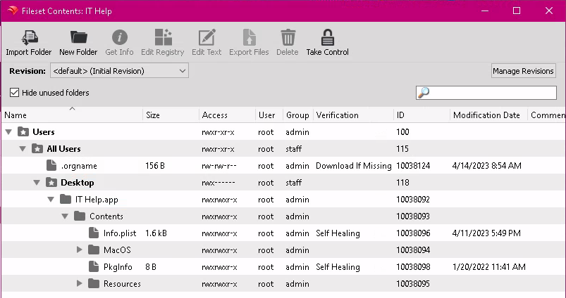

# IT Help Desktop App
Lightweight desktop app for IT teams to deploy across the organization to make it easy for staff to submit IT help tickets.

**What does this achieve?**

Universally, users don't seem to like creating tickets or help requests.

This app eases that burden by collecting data about them and their machine automatically, so all they have to do is explain what the problem is and click a button.

    **A ticket is auto-created with the following:**

        - Hostname (assumed asset tag)
        - Free space
        - Uptime / load averages
        - IP address(es)
        - Users' message
        - Users' name & email as the creator of the ticket

## OS Support
Currently MacOS only.

### Screenshots
App image:
    

Desktop shortcut:
    

Logging:
    

***
## Customize to Your Environment
- `~/.orgname` should be deployed to your users' desktop via MDM with your helpdesk info preconfigured.
    - Deploy to: `/Users/[username]/[puthere]`
    - Sample deployment from Filewave: 

- Change verbiage:
    - Modify these files:
        - `IT Help.app/Contents/MacOS/start.sh` (main window)
        - `IT Help.app/Contents/Resources/proc` (ticket submission / success or fail messages)
        - `IT Help.app/Contents/Resources/AppIcon.icns` Desktop icon, any .icns that's readable by Apple should work; we use our organization's logo for this
***

### Caveats
This is a shell-based app (code is not compiled) - for a tech-savvy user, your API token is exposed in the config dotfile, assuming they know how to read bash/shell script.

It is not recommended to publish the app outside your organization or to untrusted users.

**The app is not signed** - upload it via your MDM to your users' machines to avoid issues with Gatekeeper.

***

**This app makes some assumptions**

1. This was built for an environment that uses Nomad & Active Directory, so the users' contacts are predictible (ie. johnsmith@example.com)

    If that isn't your environment, you will want to retool and perhaps extend the API call/what email address is collected, to match your helpdesk.

2. It uses Zendesk variables for the API webhook.  If your environment differs, be sure to customize the **proc** file and **~/.orgname** config to suit.
    - Modify that stuff in `IT Help.app/Contents/Resources/proc` - just look for the **curl** reference

### Credits
Help icon from [RocketTheme.com](https://www.iconarchive.com/show/free-web-icons-by-rockettheme/Lifesaver-icon.html) at IconArchive.org